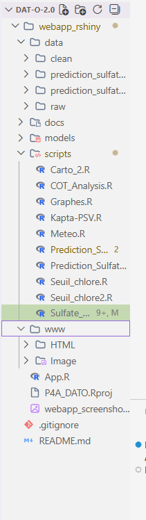

# Dat-O-2.0
## Présentation du projet

Dat-O-2.0 est un projet de semestre dont l’objectif est d’intégrer une webapp R Shiny
dans le système existant de Dato, tout en améliorant son UI/UX et en y intégrant
un script de Machine Learning pour la prédiction des sulfates.

Le projet vise à fournir une interface interactive permettant :
- le chargement de données environnementales,
- la visualisation des données,
- l’exécution de modèles de prédiction (sulfates).

---

## Objectifs du projet

- Intégrer une nouvelle webapp R Shiny dans l’écosystème existant de Dato
- Repenser la structure UI/UX de la webapp existante
- Intégrer un modèle de Machine Learning fonctionnel dans la webapp

---


## Structure du projet



## prediction_sulfate

Script ML a integrer dans `webapp_rshiny`

### Status

Pas encore integrer

### Old readme du stagiaire 

Chère Agathe ou pauvre stagiaire qui va devoir me relire, tu vas trouver ici les informations essentielles pour retrouver les résultats présentés dans mon rapport.

Dans chacun des dossiers, il y a l'intégralité des données et scripts utilisés.

Pour le sulfate, "Script Sulfate rapport.qmd" correspond au script que j'ai utilisé pour mon rapport. "Script pluvio St Martin" permet de préparer correctement les données de Saint-Martin-Vésubie.

**Enfin, "Script réseau neurones" contient le modèle final de prédiction des sulfates. Attention, l'algorithme de sélection du lag optimal a des résultats aléatoires, il faut donc les calculer une fois, modifier vec\_variables puis ne plus y toucher. S'il y a une erreur lorsque le code tourne, elle vient toujours du nom des variables de cumul de pluie.** Ce problème n'existe pas sur le Script Sulfate rapport, ce qui permet de retrouver exactement les mêmes chiffres que moi.

Pour les non-conformités, le script le plus important s'appelle "Script non conformité.qmd". Il permet de sortir tous les graphiques du rapport et d'importer les données. "Script causalité" contient les modèles logits et matchings. Il faut importer les données depuis "Script non conformité.qmd".

Bon courage,

Clément Barcaroli

clementbarcaroli@hotmail.com

## `webapp_rshiny`

Webapp a integrer dans le systeme global de Dato

### Statut

Travail en cours

## Difficultés rencontrées

- Le modèle de prédiction des sulfates a été entraîné sur les données de la station de la Vésubie (CRIPE), puis sauvegardé sous forme de modèle sérialisé afin d’être réutilisé dans la webapp Shiny.

- Lors de l’intégration du modèle dans l’application, un problème est apparu lors de la lecture des fichiers d’entrée par le modèle. Le script échouait lorsque certaines variables attendues par le modèle n’étaient pas présentes ou ne portaient pas exactement le même nom.

- Après analyse, le problème principal provenait d’un décalage entre :
  - la structure des données utilisées lors de l’entraînement du modèle,
  - et la structure des données chargées dynamiquement dans la webapp.

- En particulier, certaines variables liées aux cumuls de pluie et aux lags temporels étaient générées dynamiquement dans les scripts initiaux et n’étaient pas systématiquement disponibles dans les données fournies à l’application.

## Pistes d’amélioration

- Dans les scripts initiaux développés par Clément Barcaroli, plusieurs jeux de données (météorologiques, hydrologiques, qualité de l’eau) sont combinés afin de produire un jeu de données final unique utilisé pour l’entraînement du modèle.

- Une amélioration envisagée serait de reproduire exactement ce pipeline de génération des données en amont de la webapp, afin de garantir une parfaite cohérence entre les données d’entraînement et les données utilisées en production.

- Faute de temps (soutenance prévue le 15 janvier), cette refonte complète du pipeline de données n’a pas pu être finalisée.

- L’intégration actuelle démontre néanmoins les étapes clés du processus :
  1. entraînement du modèle,
  2. sauvegarde du modèle,
  3. intégration du modèle dans l’application Shiny pour la prédiction.

### Execution

```
# start R!
R

# Set webapp directory as working directory
setwd("~/Dat-O-2.0/webapp_rshiny")

# Launch Rshiny
shiny::runApp()
# L’application est accessible via le navigateur à l’adresse indiquée dans la console R
```
