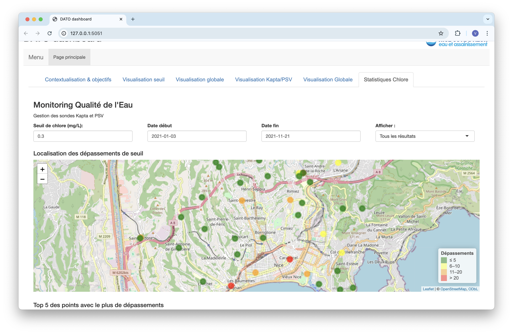

# Dat-O-2.0
Projet de semestre : 
- permettre l'integration d'une webapp rshiny dans le systeme rshiny existant de dato
- revoir la structure UI/UX de la webapp cree precedemment
- integrer un script ML a cette webapp



## prediction_sulfate

Script ML a integrer dans `webapp_rshiny`

### Status

Pas encore integrer

### Old readme

Chère Agathe ou pauvre stagiaire qui va devoir me relire, tu vas trouver ici les informations essentielles pour retrouver les résultats présentés dans mon rapport.

Dans chacun des dossiers, il y a l'intégralité des données et scripts utilisés.

Pour le sulfate, "Script Sulfate rapport.qmd" correspond au script que j'ai utilisé pour mon rapport. "Script pluvio St Martin" permet de préparer correctement les données de Saint-Martin-Vésubie.

**Enfin, "Script réseau neurones" contient le modèle final de prédiction des sulfates. Attention, l'algorithme de sélection du lag optimal a des résultats aléatoires, il faut donc les calculer une fois, modifier vec\_variables puis ne plus y toucher. S'il y a une erreur lorsque le code tourne, elle vient toujours du nom des variables de cumul de pluie.** Ce problème n'existe pas sur Script Sulfate rapport, ce qui permet de retrouver exactement les mêmes chiffres que moi.

Pour les non conformités, le script le plus important s'appelle "Script non conformité.qmd". Il permet de sortir tous les graphiques du rapport et d'importer les données. "Script causalite" contient les modèles logits et matchings. Il faut importer les données depuis "Script non conformité.qmd".

Bon courage,

Clément Barcaroli

clementbarcaroli@hotmail.com

## `webapp_rshiny`

Webapp a integrer dans le systeme global de Dato

### Statut

Travail en cours

### Execution

```
# start R!
R

# Set webapp directory as working directory
setwd("~/Dat-O-2.0/webapp_rshiny")

# Launch Rshiny
shiny::runApp()
```